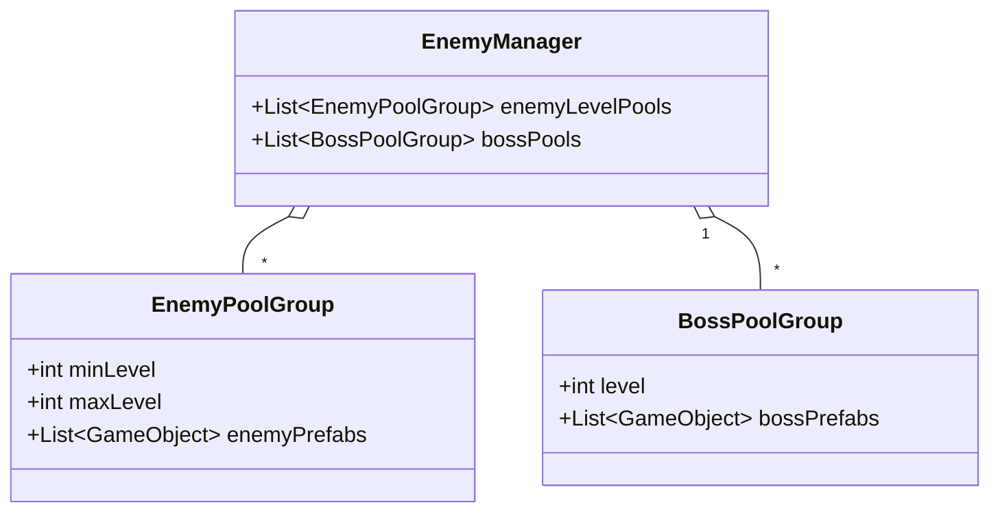
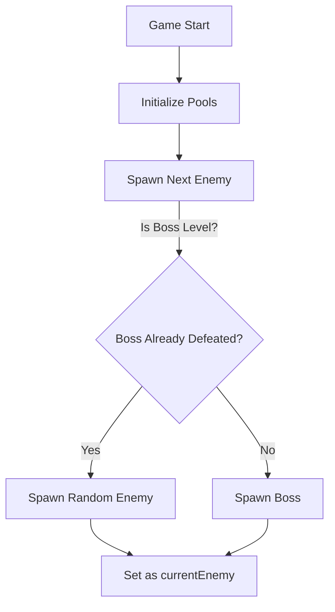
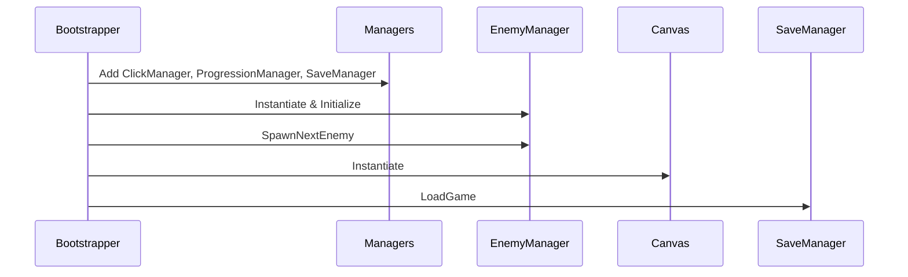
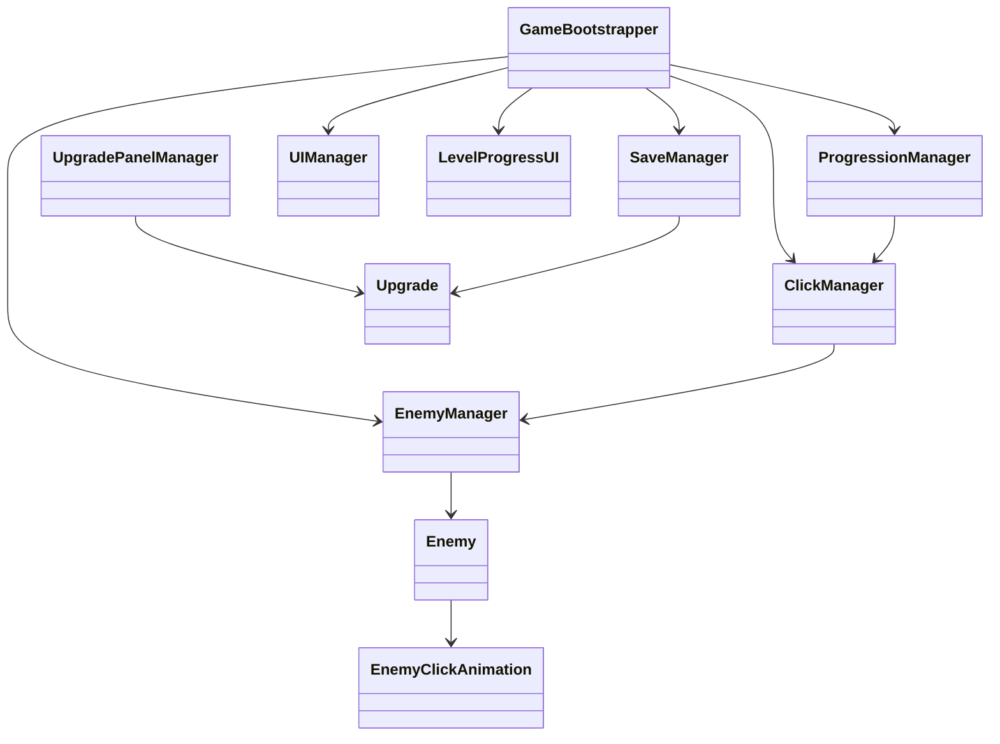

# 🎮 Unity Clicker Framework – Full Documentation

This documentation describes the core code files of a Unity clicker framework, focusing on extensibility for asset store users and clean architecture for maintainability.

---

## SaveResetEditor.cs

This is a custom Unity Editor window that allows developers to quickly **reset all saved player data** stored in PlayerPrefs during development.

- **Purpose:** 🗑️ Quickly delete PlayerPrefs save data for quick testing.
- **How:** Adds a menu item under `Tools/Reset Save Data`.

```csharp
[MenuItem("Tools/Reset Save Data")]
public static void ShowWindow() {
    EditorWindow.GetWindow(typeof(SaveResetEditor), false, "Reset Save");
}
```
**Usage Steps:**
- Go to Tools > Reset Save Data in the Unity menu.
- Click the "Delete Save" button.
- Confirms via dialog before deleting the PlayerPrefs key `"SaveData"`.

**Key Functionality**
- Safe deletion with confirmation dialog.
- Works only in Editor.

---

## EnemyManagerEditor.cs

A powerful custom Unity Editor inspector for the `EnemyManager` class, designed to streamline **enemy pool management**.

- **Purpose:** 👾 Visually configure enemy/boss pools, levels, prefabs, and quick-edit stats/statistics in the Inspector.
- **Features:** Add/remove/sort groups, edit stats, validate prefabs, clear empty slots, quick reskin, and more.

### Key Panels:

| Section             | Functionality                                                                           |
|---------------------|----------------------------------------------------------------------------------------|
| Pool Settings       | Set pool size per enemy prefab                                                         |
| Enemy Pools         | Manage lists of enemy prefabs by level range                                           |
| Boss Pools          | Manage boss prefabs by specific levels                                                 |
| Utilities           | Sort, validate, and clear pools                                                        |

### Notable Behaviors:

- Drag-and-drop prefab management for both normal enemies and bosses.
- In-place editing of `maxHP` and `expReward` for enemy prefabs.
- Quick sprite swap and color tint for rapid reskinning.
- Validation and feedback for missing/enemyless prefabs.
- Sorting and maintenance utilities.

### Example: Adding an Enemy Pool
```csharp
if (GUILayout.Button("➕ Add Enemy Pool Group", GUILayout.Height(30))) {
    enemyLevelPools.arraySize++;
    // Initialize min/max levels for the new group
}
```

#### Class Diagram



---

## UpgradePanelManagerEditor.cs

A custom Unity Editor inspector for the `UpgradePanelManager` class, enabling fast and safe **upgrade management**.

- **Purpose:** ⚡ Configure, validate, and document all upgrade components within a panel.
- **Features:** Collects all child `Upgrade` components, in-place stat editing, icon assignment/preview, batch validation.

### Key Features

- Foldout interface for upgrades with quick info.
- "Collect All Upgrades" button auto-finds and registers all `Upgrade` components.
- Icon assignment/preview for each upgrade.

---

## EnemyClickAnimation.cs

Handles all **visual feedback and animation** for enemy interactions (clicks, damage, death).

- **Purpose:** 💥 Make enemy interactions feel responsive and satisfying.
- **Tech:** Uses DOTween for smooth, composable animations.

### Main Effects

- **Click:** Scale punch, shake, color flash.
- **Damage Popup:** Floating "+X" feedback using TMP.
- **Death:** "Soul" rises and fades out.
- **Reset:** Restores original visual state.

```csharp
public void PlayClickAnimation() {
    // Punch, shake, color flash
}
public void CreateDamagePopup(int damage) {
    // Spawns and animates floating damage number
}
```

---

## ClickManager.cs

Centralizes all **point click logic** and **passive income** generation.

- **Purpose:** 🖱️ Handles player clicks, score tracking, and auto-income.
- **Singleton:** `ClickManager.Instance`
- **Events:** `OnPointsChanged` for UI sync.

### Core Concepts

- **Click/Passive Multipliers:** Upgradable by the player.
- **Passive Income:** Repeats on interval, applies auto-damage to current enemy.
- **APIs:** `Click()`, `ApplyClickUpgrade()`, `ApplyPassiveUpgrade()`, `SetPoints()`.

```csharp
public void Click() {
    int gain = pointsPerClick * clickMultiplier;
    AddPoints(gain);
}
```

---

## ProgressionManager.cs

Manages **player level and experience** progression.

- **Purpose:** 📈 Tracks leveling, EXP, and synchronizes upgrades.
- **Singleton:** `ProgressionManager.Instance`
- **Events:** `OnLevelChanged`, `OnExpChanged`
- **Level Up Formula:** EXP to next level increases by 20% per level.

### Leveling Up

```csharp
public void GainExp(int amount) {
    CurrentExp += amount;
    while (CurrentExp >= ExpToNextLevel) {
        CurrentExp -= ExpToNextLevel;
        LevelUp();
    }
    OnExpChanged?.Invoke(CurrentExp, ExpToNextLevel);
}
```

---

## SaveManager.cs

Handles game state **saving and loading** via PlayerPrefs and JSON.

- **Purpose:** 💾 Save/load player progress, upgrades, and multipliers.
- **Singleton:** `SaveManager.Instance`
- **Data:** Uses a `SaveData` struct for serialization.

### SaveData Structure

| Field             | Description                                 |
|-------------------|---------------------------------------------|
| points            | Player's current points                     |
| level             | Player level                                |
| exp               | Player experience                           |
| clickMultiplier   | Click upgrade multiplier                    |
| passiveMultiplier | Passive income multiplier                   |
| upgradeCosts      | Costs of all upgrades                       |

### Save/Load Example

```csharp
public void SaveGame() {
    // Gather all Upgrade costs, current points, multipliers, etc.
    // Serialize to JSON and store in PlayerPrefs.
}
```

---

## EnemyManager.cs

Central system for **enemy and boss spawning**, pooling, and management.

- **Purpose:** 👹 Efficiently spawns, pools, and tracks enemies and bosses by player level.
- **Singleton:** `EnemyManager.Instance`
- **Pooling:** Each prefab gets a pool for fast spawn/disable.

### Core Workflow

1. **Initialize Pools:** Pre-instantiates objects for all enemy/boss types.
2. **SpawnNextEnemy:** Decides if next enemy is a boss (level % 5), spawns from correct pool.
3. **Track Defeated Bosses:** Prevents repeat boss fights at same level.
4. **Current Enemy:** `GetCurrentEnemy()` for integration with other managers.

#### Enemy Pooling Flow



---

## LevelProgressUI.cs

Updates **UI progress indicators** for experience and leveling.

- **Purpose:** 🎚️ Syncs EXP slider and text to current progression state.
- **Subscribes:** To `OnExpChanged`, `OnLevelChanged`, and `OnPointsChanged` for instant feedback.

```csharp
private void UpdateUI() {
    // Updates slider and EXP text to reflect latest values
}
```

---

## UIManager.cs

Main UI bridge for **points, level, and save operations**.

- **Purpose:** 🖥️ Keeps level/points text in sync, and provides a save button.
- **Hooks:** Listens to `OnPointsChanged` and `OnLevelChanged`.

```csharp
saveButton.onClick.AddListener(() => SaveManager.Instance.SaveGame());
```

---

## UpgradeType.cs

Defines the available **upgrade types**.

```csharp
public enum UpgradeType { Click, Passive }
```

- **Click:** Enhances manual points per click.
- **Passive:** Increases points per second/passive gain.

---

## Upgrade.cs

Implements a single **upgrade** button/entry.

- **Purpose:** ⬆️ Upgrades click or passive abilities, increases cost after each purchase.
- **Components:** Cost text, button, and logic for each upgrade.

| Property        | Description                          |
|-----------------|--------------------------------------|
| upgradeType     | Click or Passive                     |
| multiplier      | Value added per upgrade purchase      |
| cost            | Cost of the next upgrade             |
| costText        | UI text field for cost display        |
| upgradeButton   | UI button to trigger upgrade          |

### Purchase Logic

```csharp
private void ApplyUpgrade() {
    if (ClickManager.Instance.CurrentPoints >= cost) {
        // Deduct points, apply upgrade, increase cost
    }
}
```

---

## GameBootstrapper.cs

Responsible for **initializing the full game** from a single entry point.

- **Purpose:** 🚀 Instantiates all core managers, enemy manager, canvas, and loads game state.
- **Pattern:** Singleton initialization and prefab instantiation.

### Startup Steps



---

## Enemy.cs

Represents a single **enemy unit**.

- **Purpose:** 👾 Tracks HP, handles clicks, damage, death, and experience rewards.
- **Components:** HP slider, EXP reward, click animation reference.

### Enemy Interaction

- On click: applies click value damage, plays animation, and damage popup.
- On zero HP: triggers death, awards EXP, and respawns next enemy.

---

## UpgradePanelManager.cs

Maintains and manages a set of **upgrade entries**.

- **Purpose:** 🛠️ Holds references to all upgrades in the UI panel.
- **Auto-Setup:** `CollectUpgrades()` finds all children `Upgrade` components and syncs the list.

| Field        | Description                     |
|--------------|---------------------------------|
| upgrades     | List of UpgradeData entries     |
| UpgradeData  | Holds reference and name        |

---

## System Architecture Overview



## 🛠️ Quick Reference Table

| System             | Purpose                                   | Custom Editor? | Singleton? | Extensible? |
|--------------------|-------------------------------------------|:--------------:|:----------:|:-----------:|
| EnemyManager       | Enemy/boss pooling and spawning           | ✅             | ✅         | ✅          |
| ClickManager       | Points, click, and passive income         | ❌             | ✅         | ✅          |
| ProgressionManager | Level/EXP tracking and upgrades           | ❌             | ✅         | ✅          |
| SaveManager        | Game save/load (PlayerPrefs+JSON)         | ❌             | ✅         | 🔸          |
| UpgradePanelManager| Tracks and manages upgrades in the panel  | ✅             | ❌         | ✅          |
| Upgrade            | Handles individual upgrade logic          | ❌             | ❌         | ✅          |
| Enemy              | Enemy stats, death, animation, reward     | ❌             | ❌         | ✅          |
| UIManager          | Updates points/level UI, save button      | ❌             | ❌         | ✅          |
| LevelProgressUI    | Updates EXP progress UI                   | ❌             | ❌         | ✅          |
| EnemyClickAnimation| Visual feedback for enemy interactions    | ❌             | ❌         | ✅          |

---
